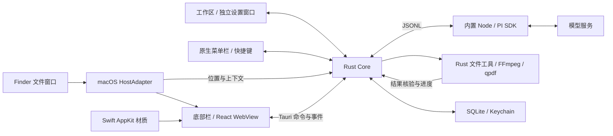
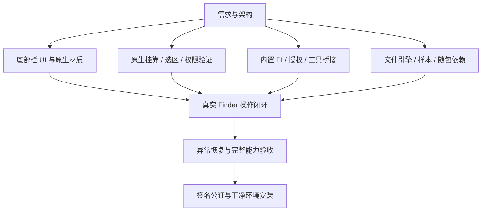

# Fleqi P0：架构与准备

本文件保存需求分析阶段的已确认决定，并纳入底部栏 UI 与 Swift 材质适配。当前实现进度见 [README](../../README.md)，完整基线见 [PRD](../product/Fleqi_PRD_v0.0.1_Final.md)。

导航：[范围与逻辑](#范围与逻辑) · [架构](#架构) · [核心行为](#核心行为) · [准备顺序](#准备顺序) · [验收](#验收)

## 范围与逻辑

先实现 Finder 下方黏附的小输入栏，macOS → Windows 资源管理器 → Linux。底部固定内置 PI；P1 侧边才可选择用户 PI。底部呈现对象、必要确认、进度与结果，详细终端过程属于侧边。

P0 文件能力已选择基础文件、ZIP、PNG/JPG/WebP 图片、音视频、PDF、TXT/Markdown 和简单 DOCX。相关引擎随包配齐，不依赖用户安装 Homebrew、Node、PI 或命令行工具。首版动作限定为基础移动复制命名、转换缩放压缩、音视频转换与裁剪、PDF 页面操作与无损结构压缩、简单文档创建及正文处理。

本地权限探针可先进行；通过 PI 操作文件的完整自检依赖模型配置。窗口可见性与任务生命周期独立。成功必须来自工具核验，而非模型文本。

## 架构

Tauri 2、React、TypeScript 和 Vite 承载界面；Rust 负责原生集成、任务与文件执行。Swift 封装 macOS 材质，不承担 Agent 引擎。原生挂靠使用 NSPanel、Accessibility 窗口观察与 Apple Events Finder 选区获取。Windows 复用核心与界面，另写 HostAdapter。

PI 的完整依赖归档随包保存，由 `runtime_package.rs` 校验并解包至内容版本对应的应用缓存，保留 pnpm 链接；避免资源打包器漏掉目录链接。PI 独立子进程使用 SDK 和固定工具，适配基线为已检查的 0.85.0，随包选择 Node 24 LTS。禁用自动发现外部插件、skills、上下文指令，文件内容只作为数据。Rust 执行器接收结构化参数，不把文件名拼成 Shell 命令。凭据存 Keychain，任务动作结果存 SQLite。

## 核心行为

- `ContextSnapshot` 固定宿主、目录、文件引用与版本；`TaskRequest` 固定快照、用户输入和模型配置。
- `ToolCall` 包含动作编号、操作类型、授权范围与参数；`TaskEvent` 包含序号、状态、进度、补充问题或已核验结果。
- P0 同时一个前台任务；中文输入法确认不提交；请求编号抑制重复提交。
- 普通 Finder 窗口空间不足时先上移，再必要时缩短高度；收起时仅恢复尚未被用户另行修改的窗口。
- 原生全屏时贴在窗口内侧底边，退出全屏恢复外侧。最小化与隐藏不取消任务。
- 取消停止后续动作；已完成部分如实记录。异常重启不静默重跑不确定动作。
- 首次账号授权后复用 Fleqi 自身有效登录态；Codex 账号与 API Key 独立验收。
- 首版协议矩阵包括 OpenAI Chat Completions、OpenAI Responses、Anthropic Messages、Google Gemini 与相同协议的自定义端点。

浅/黑 UI 等尺寸、玻璃材质和圆角规则见 [UI 规范](../design/P0_UI_Spec.md)。P1 侧边保留黑底、等宽文字、白灰信息层级、紫色输入分隔线与真实终端状态栏，左侧或顶部停靠，默认左侧作为计划值；球、箭头和终端共用一个会话。

## 准备顺序

图中后续验证节点并未因 UI 完成而通过。真实挂靠需要多窗口、标签页、显示器、全屏与焦点验证；权限需要拒绝、授权后复检、撤销及真实执行链自检。文件测试使用可清理样本，不能修改真实用户数据。发布目标暂按 macOS 15+ Apple Silicon，最低系统与发行签名仍需实测。

## 验收

| PRD 编号 | 核心证据 |
| --- | --- |
| A0-01/02/13/14 | 干净机器使用内置 PI，原有用户 PI 保持独立 |
| A0-03/04/05 | 权限拒绝、复检、撤销与非破坏性文件自检 |
| A0-06/07/15 | 窗口跟随、选区固定、全屏与中文输入、去重 |
| A0-09/16 | 各文件能力真实产物，路径、同名、只读、解压与空间边界 |
| A0-10/17 | 真实进度、取消、部分完成与异常恢复 |
| A0-08/11/12 | 展示边界、账号与协议、菜单及入口恢复 |

逐项实现与证据见 [P0 验收记录](../qa/P0_Acceptance.md)。单项测试通过不代表完整 P0 发布验收通过。

## 后端详细设计与当前实现

| 边界 | 文件 | 责任 |
| --- | --- | --- |
| 无窗口核心 | `crates/fleqi-core/src/{model,db,files}.rs` | 设置、连接与任务 DTO；SQLite 动作账本；限定文件范围、产物核验 |
| 应用入口 | `src-tauri/src/{commands,state,shell}.rs` | 单实例、窗口/Dock/菜单生命周期、配置同步、快捷键录入、单任务互斥 |
| 平台桥 | `platform.rs`、`native/Sources/FleqiGlass/` | Keychain、权限、Finder 选区、文件窗口筛选、移动稳定检测、玻璃材质 |
| 运行时 | `runtime.rs`、`runtime/pi/{entry,bridge,catalog}.mjs` | JSONL、凭据读写、授权、模型目录、固定工具、取消、错误归档 |
| 界面 | `Dashboard.tsx`、`SettingsPages.tsx`、`Models.tsx`、`AgentBar.tsx` | shadcn 工作区与弹窗、动态模型与参数、单色 Beam、斜杠菜单 |

SQLite 保存设置、模型目录、任务和执行动作，Keychain 仅保存凭据。主窗口、设置和底部栏通过 `fleqi:changed` 刷新；导航使用目标窗口事件，防止设置跳转影响其他窗口。用户的原 PI 目录不参与发现或认证。

连接先保存协议和认证类型，再登录或获取 `/models`。Codex 通过已登录账号取得真实模型目录；API 按协议读取列表并处理分页。`ModelInfo` 保存模型 ID、思考档位、默认强度和服务速度；服务未声明时保守显示默认能力。当前任务保存模型快照，更改只用于新任务。

任务提交前固定 `ContextSnapshot`，包含关联窗口、目录、文件与采样时间。Apple Events 的文件窗口 bounds 与 AX 采样前后对应；Quick Look 被排除。执行器检查对象身份、路径范围与支持参数，并在每个操作前落库。所有子进程使用参数数组，不拼接 Shell。

## 交付顺序与边界

工作区、设置、菜单栏、公共核心与随包引擎已实现并有离线测试。下一验证节点为新版原生 Finder 挂靠、权限恢复与真实模型驱动文件任务；之后进行 macOS 15 干净环境、签名与公证。Windows/Linux 目前返回挂靠不可用，P1 终端不提供可用开关。
